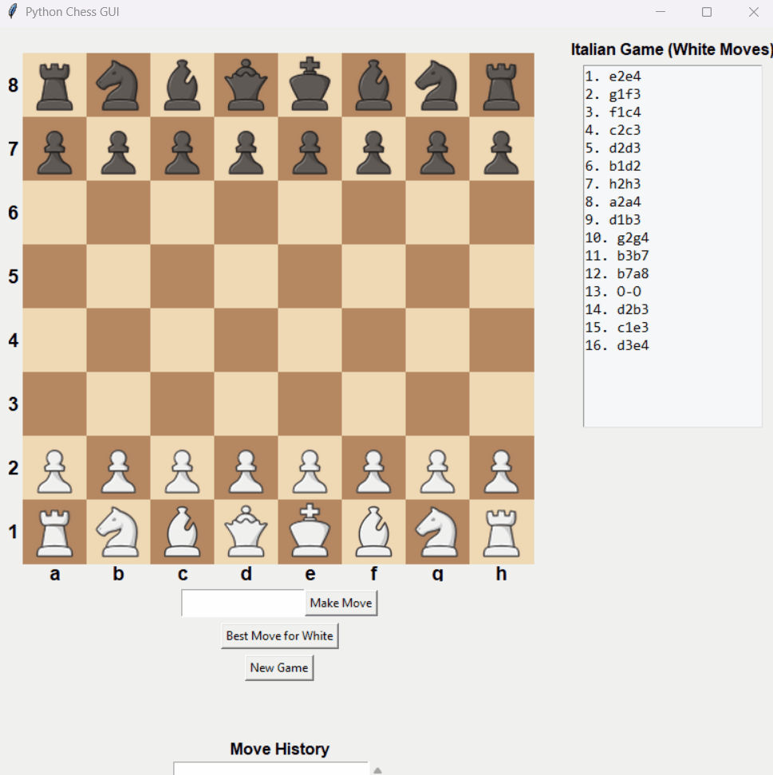

# Stockfish Chessbot (≈1800 Elo GUI)

A simple **Tkinter** chess GUI that lets you play **as White** against **Stockfish** (Black).  
Includes:
- Click-to-move board with coordinates and promotion dialog
- Move entry box (SAN/uci) + “Best Move for White”
- Scrollable move history
- Side panel with **Italian Game (White) reference moves**
- Adjustable engine strength (default config ≈ **Elo 1800**)

https://github.com/official-stockfish/Stockfish · https://python-chess.readthedocs.io/

---

## 📂 Project Structure
```
.
├── chessbot.py                 # Main GUI (play as White vs Stockfish)
├── play_chess.py               # (Optional) extra script if you use it
├── pieces/                     # Piece images used by the GUI
│   ├── wK.png wQ.png wR.png wB.png wN.png wP.png
│   └── bK.png bQ.png bR.png bB.png bN.png bP.png
├── stockfish/                  # (Optional) stockfish source/extra files (not required to run GUI)
├── stockfish-windows-x86-64-avx2.exe   # Stockfish engine (Windows build)
├── README.md
└── requirements.txt            # (Optional) dependencies list
```

> **Images required:** the GUI loads images from `pieces/` with these exact names:  
> `wK.png, wQ.png, wR.png, wB.png, wN.png, wP.png, bK.png, bQ.png, bR.png, bB.png, bN.png, bP.png`

---

## ✨ Features
- **GUI board** with coordinates and click-to-move
- **Move input** via entry box (SAN like `Nf3`, or UCI like `e2e4`)
- **Best Move for White** button (quick hint / instant move)
- **Italian Game (White) reference** panel
- **Promotion** dialog (Queen/Rook/Bishop/Knight)
- **Engine strength control** via Stockfish UCI options:
  - `Skill Level = 10`, `UCI_LimitStrength = True`, `UCI_Elo = 1800` (tweakable)

---

## 🛠️ Installation

### 1) Python & dependencies
```bash
# Create a venv (recommended)
python -m venv .venv
# Windows
.venv\Scripts\activate
# macOS/Linux
source .venv/bin/activate

pip install -U pip
pip install pillow python-chess
# On macOS you may need Tkinter:
#   brew install python-tk
```

**requirements.txt (optional)**
```
pillow
python-chess
```

### 2) Stockfish engine
- **Windows (this repo):** already included as `stockfish-windows-x86-64-avx2.exe`.
- **macOS/Linux:** install Stockfish and update the path in `chessbot.py`.
  - macOS (Homebrew): `brew install stockfish`
  - Linux (Debian/Ubuntu): `sudo apt install stockfish`
  - Then set `engine_path` accordingly (see below).

---

## ▶️ Running
```bash
python chessbot.py
```

By default the app looks for the engine here (Windows build in repo root):
```python
engine_path = os.path.join(os.path.dirname(__file__), "stockfish-windows-x86-64-avx2.exe")
```

**If you’re on macOS/Linux** (or you installed Stockfish elsewhere), change that line, e.g.:
```python
engine_path = "/usr/local/bin/stockfish"   # macOS Homebrew
# or
engine_path = "/usr/bin/stockfish"         # Linux
```

---

## 🎮 How to Play
- **You are White.** Click a piece, then click its destination square.
- Or type a move in the entry box:
  - **SAN** (e.g., `Nf3`, `O-O`, `Qxd5`)
  - **UCI** (e.g., `e2e4`, `g1f3`)
- **Promotion** prompts when a pawn reaches the back rank.
- After your move, Black (Stockfish) answers automatically.
- **Best Move for White** lets Stockfish play a quick White move for you.

---

## ♟️ Italian Game Helper
The right panel shows **White’s typical sequence** for the Italian Game (from the code’s `ITALIAN_GAME_WHITE_MOVES`).  
You can tweak the list in `chessbot.py` to study other openings.

---

## 🔧 Engine Strength / Elo
The code configures Stockfish roughly around **1800 Elo**:
```python
self.engine.configure({
    "Skill Level": 10,       # 0-20 (10 ≈ mid)
    "UCI_LimitStrength": True,
    "UCI_Elo": 1800
})
```
Increase `Skill Level` or `UCI_Elo` to make it stronger.

---

## 🖼️ Piece Images
Place 12 PNGs in `pieces/`:
```
wK.png wQ.png wR.png wB.png wN.png wP.png
bK.png bQ.png bR.png bB.png bN.png bP.png
```
Recommended size: **64×64** (the code resizes anyway).

---

## 🧪 Troubleshooting

**Error:** `FileNotFoundError: Stockfish executable not found at ...`  
→ Fix `engine_path` in `chessbot.py` to point to your Stockfish binary.

**Blank board / no pieces:**  
→ Ensure the 12 images exist in `pieces/` with the exact filenames above.

**Tkinter missing (macOS/Linux):**  
→ Install Tkinter (e.g., `brew install python-tk` on macOS).

**Chinese/Greek characters in path cause issues:**  
→ Move the project to a simple ASCII path like `C:\Projects\chessbot\`.

**Engine too strong/weak:**  
→ Adjust `Skill Level` and/or `UCI_Elo` in the `configure` call.

---

## 📸 (Optional) Screenshot
Add a screenshot to the repo and reference it here:
```

```

---

## 📦 .gitignore (Recommended)
Create a `.gitignore` to avoid committing build/cache files:
```
__pycache__/
*.pyc
*.pyo
*.DS_Store
.vscode/
```
> If the engine binary is large, consider keeping it out of Git and instruct users to install Stockfish locally.

---

## 📝 License & Credits
- GUI code: MIT © 2025 Christos (pasents) — see LICENSE
- Engine: Stockfish (not included) — GPLv3, download from https://stockfishchess.org/
- Library: python-chess — https://python-chess.readthedocs.io/
- Images: ensure you have rights to the piece PNGs you include.

## Demo

Here’s the chessbot in action:




---
